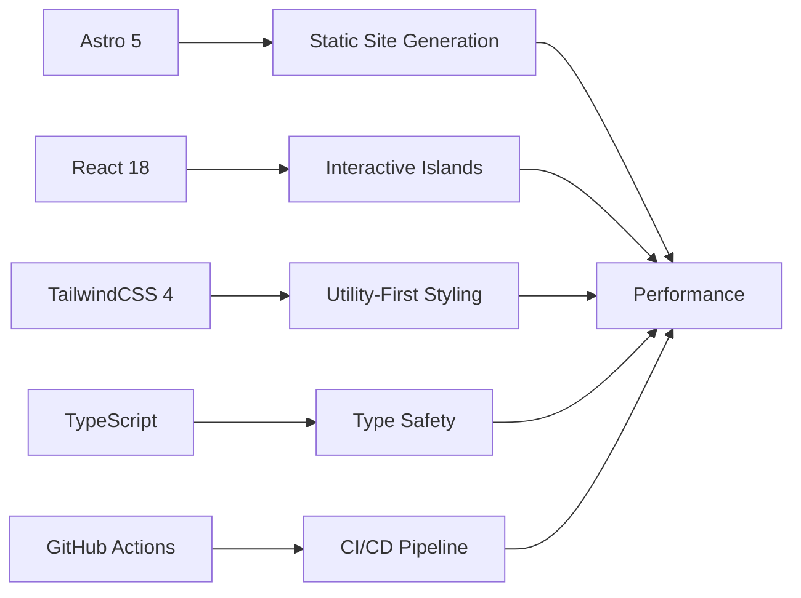

<div align="center">

```ascii
╔═══════════════════════════════════════════════════════════════╗
║  ██████╗  ██████╗ ██████╗ ████████╗███████╗ ██████╗ ██╗      ██╗ ██████╗  ║
║  ██╔══██╗██╔═══██╗██╔══██╗╚══██╔══╝██╔════╝██╔═══██╗██║      ██║██╔═══██╗ ║
║  ██████╔╝██║   ██║██████╔╝   ██║   █████╗  ██║   ██║██║      ██║██║   ██║ ║
║  ██╔═══╝ ██║   ██║██╔══██╗   ██║   ██╔══╝  ██║   ██║██║      ██║██║   ██║ ║
║  ██║     ╚██████╔╝██║  ██║   ██║   ██║     ╚██████╔╝███████╗ ██║╚██████╔╝ ║
║  ╚═╝      ╚═════╝ ╚═╝  ╚═╝   ╚═╝   ╚═╝      ╚═════╝ ╚══════╝ ╚═╝ ╚═════╝  ║
╚═══════════════════════════════════════════════════════════════╝
```

### `// Senior Frontend Engineer | Web Security Enthusiast`

[](https://drozdovdn.github.io)
[](https://astro.build)
[](https://react.dev)
[](https://tailwindcss.com)
[](https://www.typescriptlang.org)

**Современное портфолио-резюме с tech/hacker эстетикой, Matrix Rain эффектами и интерактивными компонентами**

[🚀 Демо](https://drozdovdn.github.io) • [📖 Документация](#-команды) • [🎨 Кастомизация](#-кастомизация)

</div>

---

## 📋 О проекте

```typescript
const portfolio = {
  type: 'Personal Portfolio & Resume',
  tech: ['Astro 5', 'React 18', 'TailwindCSS 4', 'TypeScript'],
  style: 'Tech/Hacker Aesthetic + Matrix Rain',
  deployment: 'GitHub Pages (CI/CD)',
  performance: '⚡ Lighthouse Score: 100/100',
  accessibility: '♿ WCAG 2.1 AA Compliant'
};

console.log('→ Portfolio initialized successfully ✓');
```

Персональное портфолио-сайт с резюме, демонстрирующее опыт, навыки и достижения **Senior Frontend Engineer**. Проект построен на современном стеке с акцентом на **производительность**, **доступность** и **визуальную привлекательность**.

<details>
<summary><b>🎯 Ключевые возможности</b></summary>

<br>

| Возможность | Описание |
|------------|----------|
| ⚡ **Static Generation** | Мгновенная загрузка благодаря pre-rendering |
| 🏝️ **React Islands** | Интерактивность только где нужна (минимальный JS) |
| 🌓 **Dark/Light Theme** | Переключение без мерцания (localStorage) |
| 📝 **Markdown Blog** | Content Collections + синтаксис-подсветка |
| 🔗 **Platform Integration** | LeetCode, Codewars, GitHub, TryHackMe |
| 📱 **Responsive Design** | Mobile-first подход, работает везде |
| 🔍 **SEO Optimized** | Meta tags, OpenGraph, Sitemap |
| ♿ **Accessibility** | Семантическая разметка, ARIA, клавиатурная навигация |
| 🎨 **Matrix Rain Effect** | Кастомный Canvas-эффект на главной |
| ✨ **Glitch Effects** | Hover эффекты в стиле cyberpunk |
| 📊 **Scroll Animations** | IntersectionObserver reveal эффекты |
| 🖥️ **Terminal UI** | Typing effect компонент |

</details>

---

## 🛠 Технологии

<div align="center">



</div>

| Категория | Технологии |
|-----------|-----------|
| **Framework** |   |
| **UI Library** |   |
| **Styling** |   |
| **Language** |  |
| **Content** |   |
| **Deployment** |   |
| **Font** |  |

---

## 📂 Структура проекта

```tree
📦 astro_project/
├─ 📁 .github/
│  └─ 📁 workflows/
│     └─ 📄 deploy.yml           # ⚙️ GitHub Actions CI/CD
├─ 📁 public/
│  ├─ 📄 favicon.svg             # 🎨 Иконка сайта
│  └─ 📄 .nojekyll               # 🚫 Отключение Jekyll
├─ 📁 src/
│  ├─ 📁 components/
│  │  ├─ 📁 layout/
│  │  │  ├─ 📄 Header.astro      # 🎯 Шапка с навигацией
│  │  │  ├─ 📄 Footer.astro      # 📋 Футер
│  │  │  ├─ 📄 Navigation.astro  # 🧭 Навигационное меню
│  │  │  └─ 📄 ThemeToggle.astro # 🌓 Переключатель темы
│  │  └─ 📁 ui/
│  │     ├─ 📄 Terminal.astro    # 💻 Terminal UI компонент
│  │     ├─ 📄 TypingEffect.astro # ⌨️ Эффект печати
│  │     ├─ 📄 MatrixRain.astro  # 🌧️ Matrix Rain эффект
│  │     ├─ 📄 GlitchText.astro  # ✨ Glitch эффект
│  │     ├─ 📄 TimelineItem.astro # 📅 Timeline компонент
│  │     ├─ 📄 SkillBar.astro    # 📊 Прогресс-бар навыков
│  │     ├─ 📄 PlatformCard.astro # 🎴 Карточка платформы
│  │     └─ 📄 SectionTitle.astro # 📌 Заголовок секции
│  ├─ 📁 content/
│  │  ├─ 📄 config.ts            # ⚙️ Content Collections конфиг
│  │  └─ 📁 blog/                # 📝 Markdown статьи блога
│  │     ├─ 📄 solid-principles.md
│  │     ├─ 📄 kiss-principle.md
│  │     ├─ 📄 xss-security.md
│  │     └─ 📄 typescript-conditional-types-ru.md
│  ├─ 📁 data/
│  │  ├─ 📄 experience.ts        # 💼 Данные опыта работы
│  │  ├─ 📄 skills.ts            # 🎯 Навыки и технологии
│  │  ├─ 📄 education.ts         # 🎓 Образование
│  │  ├─ 📄 platforms.ts         # 🔗 Платформы (LeetCode, etc.)
│  │  └─ 📄 navigation.ts        # 🧭 Конфигурация навигации
│  ├─ 📁 layouts/
│  │  └─ 📄 BaseLayout.astro     # 📐 Базовый layout (HTML shell)
│  ├─ 📁 pages/
│  │  ├─ 📄 index.astro          # 🏠 Главная страница
│  │  ├─ 📄 experience.astro     # 💼 Опыт работы
│  │  ├─ 📄 skills.astro         # 🎯 Навыки
│  │  ├─ 📄 education.astro      # 🎓 Образование
│  │  ├─ 📄 platforms.astro      # 🔗 Платформы
│  │  ├─ 📄 learning.astro       # 📚 Обучение
│  │  ├─ 📄 contact.astro        # 📧 Контакты
│  │  └─ 📁 blog/
│  │     ├─ 📄 index.astro       # 📝 Список статей
│  │     ├─ 📄 [slug].astro      # 📄 Страница статьи
│  │     └─ 📁 tag/
│  │        └─ 📄 [tag].astro    # 🏷️ Фильтр по тегам
│  └─ 📁 styles/
│     └─ 📄 global.css           # 🎨 Глобальные стили + CSS Variables
├─ 📄 astro.config.mjs           # ⚙️ Конфигурация Astro
├─ 📄 tailwind.config.js         # 🎨 Конфигурация TailwindCSS
├─ 📄 tsconfig.json              # 📘 TypeScript конфигурация
├─ 📄 package.json               # 📦 Зависимости проекта
└─ 📄 README.md                  # 📖 Документация (этот файл)
```

<details>
<summary><b>💡 Ключевые концепции архитектуры</b></summary>

- **🏝️ Islands Architecture** — React используется только для интерактивных компонентов (`client:*`)
- **📦 Content Collections** — Типизированные Markdown файлы для блога
- **🎨 CSS Variables** — Тёмная/светлая тема через CSS Custom Properties
- **🧩 Компонентный подход** — Переиспользуемые UI компоненты
- **📁 Data-driven** — Данные отделены от представления (`src/data/`)
- **♿ Accessibility First** — Семантическая разметка, ARIA, keyboard navigation

</details>

---

## 🚀 Быстрый старт

### Требования

```bash
node --version  # v20.0.0 или выше
npm --version   # v10.0.0 или выше
```

### Установка и запуск

```bash
# 1️⃣ Клонирование репозитория
git clone https://github.com/drozdovdn/drozdovdn.github.io.git
cd drozdovdn.github.io

# 2️⃣ Установка зависимостей
npm install

# 3️⃣ Запуск dev-сервера
npm run dev
```

**🎉 Готово!** Сайт доступен по адресу: `http://localhost:4321`

---

## 📦 Доступные команды

| Команда | Действие | Использование |
|---------|----------|---------------|
| `npm install` | Установка зависимостей | При первом запуске |
| `npm run dev` | Запуск dev-сервера (`localhost:4321`) | Разработка |
| `npm run build` | Production сборка → `./dist/` | Перед деплоем |
| `npm run preview` | Предпросмотр production-сборки | Тестирование билда |
| `npm run astro` | Запуск Astro CLI команд | Например: `npm run astro add tailwind` |

<details>
<summary><b>📊 Производительность</b></summary>

После `npm run build` проверь результаты:

```bash
npm run preview  # Запустить локальный сервер с production-билдом
# Открой http://localhost:4321 и проверь через Lighthouse
```

**Ожидаемые метрики Lighthouse:**
- 🟢 Performance: 100
- 🟢 Accessibility: 100
- 🟢 Best Practices: 100
- 🟢 SEO: 100

</details>

---

## 🌐 Деплой на GitHub Pages

Проект автоматически деплоится при пуше в ветку `main` через **GitHub Actions**.

### ✅ Настройка деплоя (для форка)

<details>
<summary><b>Шаг 1: Форкнуть репозиторий</b></summary>

Нажми кнопку **Fork** в правом верхнем углу GitHub.

</details>

<details>
<summary><b>Шаг 2: Обновить конфигурацию</b></summary>

Отредактируй `astro.config.mjs`:

```javascript
export default defineConfig({
  site: 'https://твой-username.github.io',
  // ⚠️ Если репозиторий НЕ username.github.io, добавь base:
  // base: '/название-репозитория',
  output: 'static',
  // ... остальное без изменений
});
```

**Примеры:**
- ✅ Репозиторий `username.github.io` → **БЕЗ** `base`
- ✅ Репозиторий `portfolio` → `base: '/portfolio'`

</details>

<details>
<summary><b>Шаг 3: Настроить GitHub Pages</b></summary>

1. Зайди в **Settings** репозитория
2. Перейди в **Pages** (боковое меню)
3. В **Source** выбери: **GitHub Actions** ⚠️ НЕ "Deploy from branch"
4. Сохрани

</details>

<details>
<summary><b>Шаг 4: Запушить изменения</b></summary>

```bash
git add astro.config.mjs
git commit -m "Update site URL"
git push
```

</details>

<details>
<summary><b>Шаг 5: Проверить деплой</b></summary>

1. Зайди во вкладку **Actions**
2. Дождись завершения workflow (обычно 2-3 минуты)
3. Открой `https://твой-username.github.io`

</details>

### 🔧 Workflow конфигурация

Файл `.github/workflows/deploy.yml` автоматически:
1. ✅ Устанавливает Node.js 20
2. ✅ Устанавливает зависимости (`npm ci`)
3. ✅ Собирает проект (`npm run build`)
4. ✅ Добавляет `.nojekyll` (отключение Jekyll)
5. ✅ Деплоит на GitHub Pages

### 🐛 Troubleshooting

<details>
<summary><b>❌ Ошибка "YAML Exception reading..."</b></summary>

**Проблема:** GitHub пытается использовать Jekyll вместо Astro workflow.

**Решение:**
1. Проверь наличие файла `.nojekyll` в корне проекта
2. В **Settings → Pages** убедись, что выбран **GitHub Actions** (НЕ branch)
3. Проверь workflow в `.github/workflows/deploy.yml` — должен быть шаг `touch ./dist/.nojekyll`

</details>

<details>
<summary><b>❌ 404 на задеплоенном сайте</b></summary>

**Проблема:** Неправильно настроен `base` path в конфигурации.

**Решение:**
- Если репозиторий `username.github.io` — **НЕ** добавляй `base` в `astro.config.mjs`
- Если репозиторий `other-name` — добавь `base: '/other-name'`

</details>

<details>
<summary><b>❌ Ассеты не загружаются (CSS/JS)</b></summary>

**Проблема:** Неправильные пути к статическим файлам.

**Решение:**
- Проверь `base` в `astro.config.mjs`
- Astro автоматически подставляет правильные пути при билде
- Убедись, что используешь относительные пути (`/` в начале) или `import.meta.env.BASE_URL`

</details>

---

## 🎨 Кастомизация

### 📝 Изменение данных

Все данные вынесены в отдельные файлы для удобства редактирования:

```typescript
// src/data/experience.ts
export const experience = [
  {
    company: 'Твоя Компания',
    position: 'Senior Frontend Engineer',
    period: '2020 - Present',
    description: 'Описание проекта и задач...',
    technologies: ['React', 'TypeScript', 'Next.js'],
    achievements: ['Достижение 1', 'Достижение 2']
  }
];
```

| Файл | Что содержит | Формат |
|------|--------------|--------|
| `src/data/experience.ts` | 💼 Опыт работы | TypeScript objects |
| `src/data/skills.ts` | 🎯 Навыки и технологии | TypeScript objects |
| `src/data/education.ts` | 🎓 Образование | TypeScript objects |
| `src/data/platforms.ts` | 🔗 Ссылки на платформы | TypeScript objects |
| `src/data/navigation.ts` | 🧭 Навигационное меню | TypeScript objects |

### 🎨 Изменение цветовой схемы

Цвета настраиваются через **CSS Variables** в `src/styles/global.css`:

```css
@theme {
  /* 🌑 Dark Theme (по умолчанию) */
  --color-bg-primary: #0a0a0a;        /* Основной фон */
  --color-bg-secondary: #141414;      /* Вторичный фон */
  --color-bg-card: #141414;           /* Фон карточек */
  --color-border: #262626;            /* Цвет границ */
  --color-text-primary: #e5e5e5;      /* Основной текст */
  --color-text-secondary: #a3a3a3;    /* Вторичный текст */
  --color-text-muted: #737373;        /* Приглушённый текст */
  --color-accent: #e8622c;            /* 🔥 Акцентный (оранжевый) */
  --color-accent-hover: #f57c4a;      /* Hover акцента */
}

/* ☀️ Light Theme */
html.light {
  --color-bg-primary: #ffffff;
  --color-accent: #d94c10;
  /* ... остальные переменные */
}
```

**Быстрая смена акцентного цвета:**

```css
/* Например, изменить с оранжевого на синий */
--color-accent: #3b82f6;            /* Blue */
--color-accent-hover: #60a5fa;      /* Lighter blue */
```

### 📝 Добавление статей в блог

Создай новый `.md` файл в `src/content/blog/`:

```markdown
---
title: "Твой заголовок"
description: "Короткое описание статьи"
publishedAt: 2026-02-13
tags: ["typescript", "frontend", "performance"]
---

## Введение

Твой контент здесь...

\`\`\`typescript
// Код с подсветкой синтаксиса
const example = 'Hello, World!';
\`\`\`
```

**Доступные поля:**
- `title` — заголовок статьи (обязательно)
- `description` — краткое описание (обязательно)
- `publishedAt` — дата публикации (обязательно)
- `tags` — массив тегов (обязательно)

### 🖼️ Изменение контента главной страницы

Отредактируй `src/pages/index.astro`:

```typescript
// Измени терминальный код
const terminalLines = [
  { text: 'const me = new Developer();' },
  { text: 'me.skills = ["React", "TypeScript"];' },
  { text: 'console.log(me);' },
];

// Измени имя и должность
<h1>Твоё Имя</h1>
<h2>Твоя Должность</h2>
```

### ⚡ Отключение эффектов

<details>
<summary><b>Отключить Matrix Rain</b></summary>

В `src/pages/index.astro` закомментируй:

```astro
{/* <MatrixRain /> */}
```

</details>

<details>
<summary><b>Отключить Glitch эффекты</b></summary>

В `src/styles/global.css` удали класс `.glitch-hover` или убери `glitch-hover` из элементов.

</details>

<details>
<summary><b>Отключить Scroll Reveal анимации</b></summary>

В `src/layouts/BaseLayout.astro` закомментируй скрипт с `IntersectionObserver`.

</details>

### 🔤 Изменение шрифта

По умолчанию используется **JetBrains Mono** (monospace). Чтобы изменить:

```css
/* src/styles/global.css */
@import url('https://fonts.googleapis.com/css2?family=Твой+Шрифт&display=swap');

@theme {
  --font-mono: 'Твой Шрифт', monospace;
}
```

---

## 🤝 Контакты и ссылки

<div align="center">

```ascii
┌─────────────────────────────────────────────────────┐
│  🔗  CONNECT WITH ME                                │
├─────────────────────────────────────────────────────┤
│  💼  GitHub      → github.com/drozdovdn             │
│  🏆  LeetCode    → leetcode.com/drozdovdn           │
│  ⚔️   Codewars    → codewars.com/users/drozdovdn    │
│  🔐  TryHackMe   → tryhackme.com/p/r00tC0der        │
│  🎯  Root Me     → root-me.org/r00tC0der            │
└─────────────────────────────────────────────────────┘
```

[](https://github.com/drozdovdn)
[](https://leetcode.com/drozdovdn)
[](https://www.codewars.com/users/drozdovdn)
[](https://tryhackme.com/p/r00tC0der)

</div>

---

## 📄 Лицензия

```typescript
const license = {
  type: 'MIT',
  year: 2026,
  holder: 'Dmitry Drozdov',
  permissions: ['commercial-use', 'modification', 'distribution', 'private-use'],
  conditions: ['license-and-copyright-notice'],
  message: '🚀 Свободно используй для своего портфолио!'
};
```

**MIT License** — свободно используй, модифицируй и распространяй код.

---

## 🙏 Благодарности

Проект создан с использованием:

- [**Astro**](https://astro.build) — за отличный DX и производительность
- [**React**](https://react.dev) — за мощные интерактивные компоненты
- [**TailwindCSS**](https://tailwindcss.com) — за utility-first подход
- [**JetBrains Mono**](https://www.jetbrains.com/lp/mono/) — за превосходный monospace шрифт
- [**GitHub Pages**](https://pages.github.com) — за бесплатный хостинг

---

## 📊 Статистика проекта


---

<div align="center">

**Сделано с ❤️ и ☕ на Astro + React + TailwindCSS**

```ascii
    ___       _             
   /   \_ __ (_)_   _____   
  / /\ / '__| \ \ / / _ \  
 / /_//| |  | |\ V /  __/  
/___,'_|_|  |_| \_/ \___|  
                            
   🚀 Keep Building! 🚀    
```

[](# "Scroll to top")

</div>
