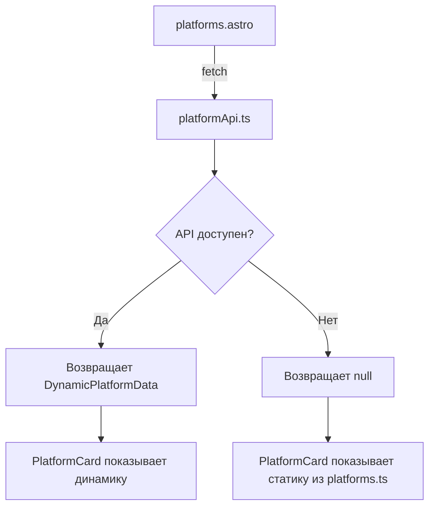

# Итоги рефакторинга: CTF → Platforms

## Выполненные изменения

### ✅ 1. Создана утилита для динамической загрузки данных
**Файл:** `src/utils/platformApi.ts`

- **LeetCode** — полностью динамическая загрузка через GraphQL API
- **TryHackMe** — попытка загрузки через публичный API (может быть ограничен)
- **Root Me** — статические данные (API закрыто)
- **Hack The Box** — статические данные (требует API key)

### ✅ 2. Обновлён компонент PlatformCard
**Файл:** `src/components/ui/PlatformCard.astro`

Добавлены опциональные пропсы:
- `dynamicRank` — динамический ранг с API
- `dynamicStats` — динамическая статистика с API

Если данные с API доступны — отображаются они, иначе fallback на статику из `platforms.ts`.

### ✅ 3. Переименованы страницы
- `src/pages/en/ctf.astro` → `src/pages/en/platforms.astro`
- `src/pages/ru/ctf.astro` → `src/pages/ru/platforms.astro`

Старые файлы удалены.

### ✅ 4. Удалён блок "CTF Achievements"
Полностью убран раздел с достижениями CTF:
- Удалён импорт `CTFCard`
- Удалён импорт `ctfAchievements`
- Удалён весь JSX с рендерингом достижений

Теперь страница показывает только блок с платформами.

### ✅ 5. Обновлены навигация и переводы
**Файлы:**
- `src/components/layout/Navigation.astro`
- `src/i18n/ui.ts`

Изменения:
- `nav.ctf` → `nav.platforms`
- Путь: `/ctf/` → `/platforms/`
- Переводы:
  - EN: "CTF & Platforms" → "Platforms"
  - RU: "CTF & Платформы" → "Платформы"
- Удалены ключи `ctf.achievements` и `ctf.platforms`
- Добавлены новые ключи `platforms.title` и `platforms.subtitle`

### ✅ 6. Удалены ненужные файлы
- ❌ `src/data/ctf.ts` (данные о CTF достижениях)
- ❌ `src/components/ui/CTFCard.astro` (карточка достижений)
- ❌ `src/pages/en/ctf.astro` (старая страница)
- ❌ `src/pages/ru/ctf.astro` (старая страница)

---

## Как это работает



### Пример для LeetCode:
1. Страница делает запрос к LeetCode GraphQL API
2. Получает актуальные данные: ранг, количество задач, рейтинг
3. Передаёт их в `PlatformCard` через `dynamicRank` и `dynamicStats`
4. Карточка отображает live-данные

### Пример для Root Me:
1. Страница делает запрос (API недоступно)
2. Возвращается `null`
3. `PlatformCard` использует статику из `platforms.ts`
4. Карточка отображает заранее заданные данные

---

## Тестирование

### Сборка проекта
```bash
npm run build
```

**Результат:** ✅ Успешно, без ошибок

### Dev-сервер
```bash
npm run dev
```

Проверьте страницы:
- http://localhost:4321/en/platforms/
- http://localhost:4321/ru/platforms/

---

## Дополнительная документация

См. файл `PLATFORM_API.md` для деталей работы API интеграции.

---

## Итоги

- ✅ CTF блок полностью удалён
- ✅ Страница переименована в "Platforms"
- ✅ Динамическая загрузка данных (где возможно)
- ✅ Fallback на статику (где API недоступен)
- ✅ Проект собирается без ошибок
- ✅ Все TODO выполнены
