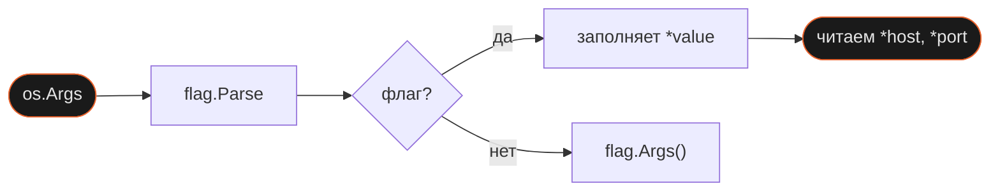

Когда пишешь security-инструмент на Go, первое что нужно — принять хост, порт и режим работы из командной строки. В Node.js для этого устанавливают `yargs` или `commander`. В Go всё нужное есть в стандартной библиотеке — пакет `flag`.

## Зачем это нужно

Без флагов параметры захардкожены в коде. Флаги решают это: `./scanner -host 192.168.1.1 -port 80 -verbose`. В JS за это отвечает `minimist(process.argv.slice(2))` или `yargs.argv`. В Go пакет `flag` входит в stdlib — никаких зависимостей.

Ключевое отличие от JS: `flag.String(...)` не возвращает строку — он возвращает `*string`, указатель. Значение появляется в указателе только после `flag.Parse()`.

## Как это устроено

Пакет `flag` работает в три шага: объявить флаги → вызвать `flag.Parse()` → читать через разыменование.

```go
host    := flag.String("host", "", "hostname or IP address")
port    := flag.Int("port", 0, "port number")
verbose := flag.Bool("verbose", false, "verbose mode")

flag.Parse()

fmt.Printf("Target: %s:%d\n", *host, *port)
```

`flag.String(name, default, usage)` регистрирует флаг в глобальном `FlagSet` и возвращает указатель на строку. До `flag.Parse()` в этом указателе лежит дефолтное значение. `Parse()` проходит по `os.Args[1:]` и заполняет указатели из аргументов командной строки.



`flag.Args()` возвращает аргументы **после** флагов — всё что не начинается с `-`. Это позиционные аргументы: `./scanner -verbose 192.168.1.1 192.168.1.2` — хосты попадут в `flag.Args()`.

`os.Args` — сырой доступ ко всем аргументам включая имя программы (`os.Args[0]`). Нужен редко — когда важен порядок аргументов или нужен доступ до `Parse()`.

## Как использовать

**Обязательные флаги** — в пакете `flag` нет встроенного `required`, но паттерн простой: пустой дефолт + проверка + `os.Exit(1)`.

```go
host := flag.String("host", "", "hostname or IP address")
port := flag.Int("port", 0, "port number")
flag.Parse()

if *host == "" || *port == 0 {
    flag.Usage() // печатает справку по всем зарегистрированным флагам
    os.Exit(1)
}
```

**Кастомная справка** — переопределяем `flag.Usage`:

```go
flag.Usage = func() {
    fmt.Fprintf(os.Stderr, "Usage: scanner -host <ip> -port <port> [-verbose]\n\n")
    flag.PrintDefaults()
}
```

**Verbose-режим** — частый паттерн для security-инструментов:

```go
if *verbose {
    fmt.Fprintln(os.Stderr, strings.Join(os.Args, " "))
}
```

## Подводные камни

**Читать флаги до `flag.Parse()`**

```go
❌ host := flag.String("host", "", "...")
   fmt.Println(*host) // "" — Parse ещё не вызван
   flag.Parse()
```

```go
✅ host := flag.String("host", "", "...")
   flag.Parse()
   fmt.Println(*host) // реальное значение из командной строки
```

Компилятор не предупредит. Флаги объявлены, но значения из `os.Args` никогда не попадут в указатели.

**Путать `flag.Args()` и `os.Args`**

```go
❌ // хочу получить аргументы без флагов
   args := os.Args[1:] // включает флаги: ["-host", "1.1.1.1", "-port", "80"]
```

```go
✅ flag.Parse()
   args := flag.Args() // только позиционные: ["192.168.1.1", "192.168.1.2"]
```

`os.Args` — сырой слайс всех аргументов. `flag.Args()` — только то, что не распознано как флаг.

**Забыть разыменовать указатель**

```go
❌ fmt.Printf("host: %s\n", host)  // выведет адрес: 0xc000010230
```

```go
✅ fmt.Printf("host: %s\n", *host) // "192.168.1.1"
```

`host` — это `*string`, адрес. `*host` — значение по этому адресу.

## Лучшие практики

**Вызывать `flag.Parse()` в начале `main()`** — до любого чтения флагов и до основной логики программы.

**Валидировать сразу после `Parse()`** — проверка обязательных флагов в одном месте, до начала работы.

**Переопределять `flag.Usage`** — дефолтная справка выводит только список флагов без примера использования.

**`flag.Args()` для позиционных аргументов** — `os.Args` нужен только для доступа к имени программы или до вызова `Parse()`.

## Итого

- **`flag.String/Int/Bool` возвращают указатели** — значения читаются через `*` только после `flag.Parse()`.
- **`flag.Parse()` обязателен** — без него все флаги содержат дефолтные значения.
- **`flag.Args()` и `os.Args` — разные вещи** — первый даёт позиционные аргументы, второй — весь сырой срез.
- **Обязательный флаг = пустой дефолт + проверка + `os.Exit(1)`** — встроенного `required` нет.
- Следующий шаг — `net.Dial` и TCP: флаги CLI станут входом для настоящих сетевых инструментов.

## Документация

- [pkg.go.dev/flag](https://pkg.go.dev/flag) — пакет flag: FlagSet, Parse, Args, Usage
- [pkg.go.dev/os#Args](https://pkg.go.dev/os#Args) — os.Args
