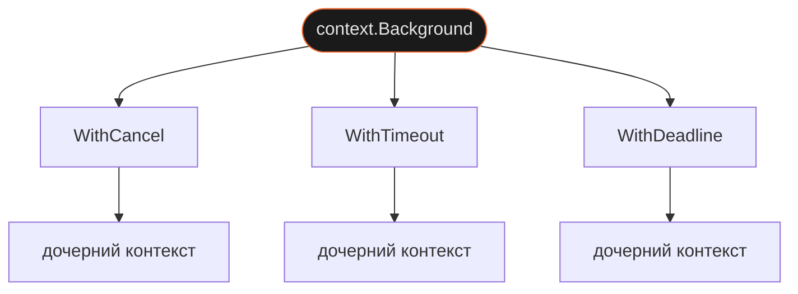

В HTTP-сервере каждый запрос должен завершиться за разумное время. В CLI-сканере пользователь должен иметь возможность прервать работу через Ctrl+C. В обоих случаях нужен механизм, который сигнализирует через всю цепочку вызовов: «стоп, больше не нужно». В Go это `context.Context` — явный параметр, который несёт сигнал отмены и дедлайн через весь стек.

## Зачем это нужно

В браузере есть `AbortController`: создаёшь контроллер, передаёшь `signal` в `fetch`, вызываешь `abort()` — запрос отменяется. Это работает в однопоточной модели с колбэками.

В Go аналог — `context.Context`, но с ключевым отличием: контекст передаётся явно первым параметром в каждую функцию. Никакого глобального состояния, никаких thread-local переменных. Если функция принимает `ctx context.Context` — она обязана его уважать: проверять `ctx.Done()` и прекращать работу при отмене.

## Как это устроено

Контексты образуют иерархию: дочерний отменяется вместе с родительским.



**`WithTimeout`** — автоматическая отмена через заданное время:
```go
ctx, cancel := context.WithTimeout(parent, 500*time.Millisecond)
defer cancel()
```

**`WithDeadline`** — отмена в конкретный момент:
```go
deadline := time.Now().Add(10 * time.Second)
ctx, cancel := context.WithDeadline(parent, deadline)
defer cancel()
```

**`WithCancel`** — ручная отмена, без таймера:
```go
ctx, cancel := context.WithCancel(parent)
// вызвать cancel() когда нужно остановить
```

`ctx.Done()` — канал, который закрывается при любом виде отмены. `ctx.Err()` — причина: `context.Canceled` или `context.DeadlineExceeded`.

## Как использовать

**Таймаут на одно соединение:**

```go
ctx, cancel := context.WithTimeout(context.Background(), 3*time.Second)
defer cancel() // обязательно, даже если таймаут сработал первым

conn, err := net.Dialer{}.DialContext(ctx, "tcp", "10.0.0.1:80")
```

`defer cancel()` — сразу после создания контекста. Без него Go не освободит ресурсы до истечения таймаута.

**Сканер с двумя уровнями контекста:**

```go
func scanWithContext(ctx context.Context, host string, ports []int) []int {
    results := make(chan int, len(ports))
    var wg sync.WaitGroup

    for _, port := range ports {
        wg.Add(1)
        go func(p int) {
            defer wg.Done()

            dialCtx, cancel := context.WithTimeout(ctx, 300*time.Millisecond)
            defer cancel()

            conn, err := net.Dialer{}.DialContext(dialCtx, "tcp", fmt.Sprintf("%s:%d", host, p))
            if err != nil {
                return
            }
            conn.Close()
            results <- p
        }(port)
    }

    go func() { wg.Wait(); close(results) }()

    var open []int
    for port := range results {
        open = append(open, port)
    }
    return open
}
```

Два уровня: внешний `ctx` (таймаут на всё сканирование или Ctrl+C) и дочерний `dialCtx` (таймаут на одно соединение). Отмена внешнего автоматически отменяет все дочерние.

**Горутина с кооперативным завершением:**

```go
go func() {
    for {
        select {
        case <-ctx.Done():
            return
        default:
            doWork()
        }
    }
}()
```

## Подводные камни

**Забыть `defer cancel()` — утечка ресурсов:**

```go
// ❌ cancel отброшен через _ — ресурсы контекста не освободятся до таймаута
ctx, _ := context.WithTimeout(parent, 3*time.Second)

// ✅ всегда defer cancel() — даже если таймаут сработает первым
ctx, cancel := context.WithTimeout(parent, 3*time.Second)
defer cancel()
```

При нагрузке накапливается: каждый незакрытый контекст держит внутренний таймер и горутину.

**`net.DialContext` как функция пакета не существует:**

```go
// ❌ такой функции нет в пакете net
conn, err := net.DialContext(ctx, "tcp", addr)

// ✅ нужен net.Dialer{}
conn, err := net.Dialer{}.DialContext(ctx, "tcp", addr)
```

**Проверять `ctx.Err()` до вызова — не защищает:**

```go
// ❌ таймаут может истечь внутри DialContext, а не до него
if ctx.Err() != nil {
    return ctx.Err()
}
conn, err := net.Dialer{}.DialContext(ctx, "tcp", addr)

// ✅ проверяй после — различай таймаут и сетевую ошибку
conn, err := net.Dialer{}.DialContext(ctx, "tcp", addr)
if err != nil {
    if ctx.Err() != nil {
        return fmt.Errorf("таймаут при подключении к %s: %w", addr, ctx.Err())
    }
    return fmt.Errorf("ошибка подключения к %s: %w", addr, err)
}
```

## Лучшие практики

- **`ctx` — всегда первый параметр.** Сигнатура `func f(ctx context.Context, ...)` — стандарт Go. Линтер `contextcheck` проверяет это.
- **`context.Background()` только на верхнем уровне** — в `main`, в хендлере HTTP. Внутри функций получай контекст от вызывающего.
- **Не храни контекст в структурах.** `context.Context` — параметр вызова, не состояние объекта. Поле в структуре означает что контекст переживёт запрос.
- **Дочерний контекст с меньшим таймаутом** — даёт точный контроль на каждом уровне, не перегружает сеть при отмене верхнего.

## Итого

- **Контексты иерархичны** — отмена родительского отменяет все дочерние автоматически.
- **`defer cancel()` сразу после создания** — утечка ресурсов накапливается под нагрузкой, не видна при ручном тесте.
- **Явная передача vs глобальное состояние** — `ctx` как параметр позволяет видеть область действия отмены из сигнатуры функции.
- **Горутину нельзя убить принудительно** — кооперативное завершение через `ctx.Done()` — осознанное решение языка для безопасного освобождения ресурсов.
- Дальше: `context.WithValue` для request-scoped данных, `errgroup` для отмены при первой ошибке в группе горутин.

## Документация

- [pkg.go.dev/context](https://pkg.go.dev/context) — пакет context: все типы и функции
- [go.dev/blog/context](https://go.dev/blog/context) — Go Blog: паттерны использования context
- [pkg.go.dev/net#Dialer](https://pkg.go.dev/net#Dialer) — net.Dialer: DialContext и таймауты соединений
