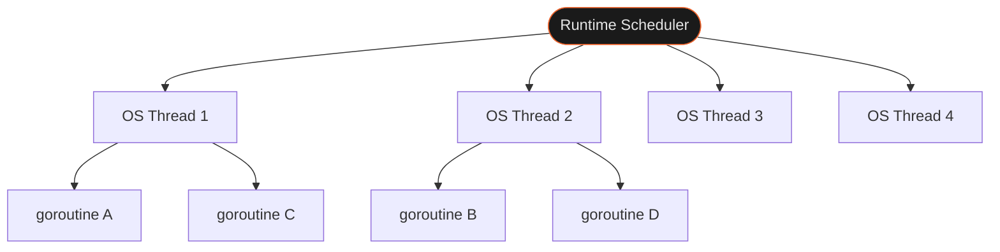
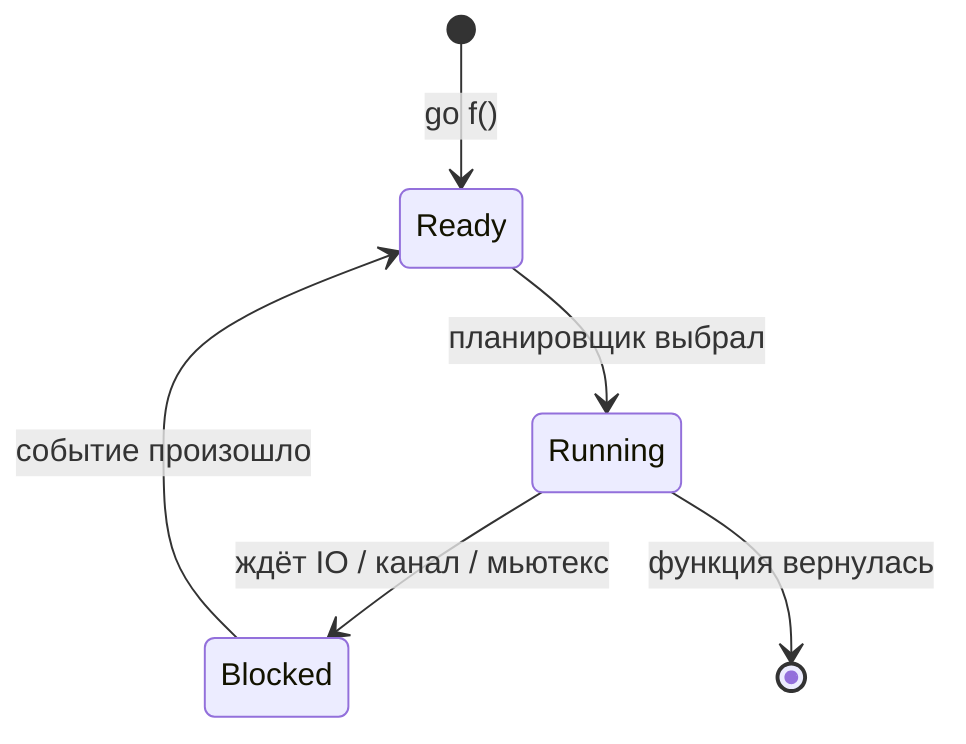

Горутина и `async/await` делают похожее — запускают код в фоне. Но между ними принципиальная разница: JS event loop — это иллюзия параллельности в одном потоке, горутины — реальное выполнение на нескольких CPU-ядрах одновременно. Это меняет то, какая синхронизация нужна и где возникают ошибки.

## Зачем это нужно

В JS конкурентность — кооперативная: один поток, `await fetch()` не блокирует его, а ставит продолжение в очередь. Гонок данных нет по определению — параллелизма просто нет.

**JavaScript** — один поток, задачи идут последовательно:


**Go** решает задачу иначе: горутины — легковесные потоки со стартовым стеком ~2KB (против мегабайт у OS-потока). Можно запустить тысячи без проблем. Runtime сам распределяет горутины по OS-потокам через планировщик M:N. Следствие реального параллелизма — несколько горутин могут одновременно читать и писать одни данные, значит нужна явная синхронизация.

## Как это устроено

Планировщик Go распределяет горутины по OS-потокам:



Запуск — ключевое слово `go` перед вызовом. Горутина стартует, основная программа продолжает без ожидания:

```go
go func() {
    fmt.Println("выполняется параллельно")
}()
```

Горутину нельзя убить снаружи — нет `goroutine.kill()`. Горутина сама проверяет сигнал завершения через `ctx.Done()` или канал.

Жизненный цикл горутины:



## Как использовать

**WaitGroup — дождаться нескольких горутин:**

```go
var wg sync.WaitGroup

for _, port := range ports {
    wg.Add(1)             // до go, не внутри
    go func(p int) {
        defer wg.Done()   // первая строка горутины
        checkPort(p)
    }(port)               // передаём значение аргументом
}

wg.Wait()
```

`wg.Add(1)` до `go`, `defer wg.Done()` — первая строка горутины. Два правила, которые не обсуждаются.

**Горутина с возвратом значения через канал:**

```go
result := make(chan int, 1)
go func() {
    result <- compute()
}()
fmt.Println(<-result)
```

Буферизованный канал на 1 элемент — горутина не блокируется на отправке, даже если читатель ещё не дошёл до `<-result`.

**Отмена через context:**

```go
ctx, cancel := context.WithCancel(context.Background())
defer cancel()

go func() {
    for {
        select {
        case <-ctx.Done():
            return // кооперативное завершение
        default:
            doWork()
        }
    }
}()
```

## Подводные камни

**Захват переменной цикла — все горутины видят одно значение:**

```go
// ❌ все напечатают последнее значение port из range
for _, port := range ports {
    go func() {
        fmt.Println(port) // захват по ссылке
    }()
}

// ✅ передаём значение аргументом — каждая горутина получает копию
for _, port := range ports {
    go func(p int) {
        fmt.Println(p)
    }(port)
}
```

**`wg.Add(1)` внутри горутины — race condition:**

```go
// ❌ Add вызывается уже после go — Wait может завершиться раньше
go func() {
    wg.Add(1)
    defer wg.Done()
    doWork()
}()

// ✅ Add строго до go
wg.Add(1)
go func() {
    defer wg.Done()
    doWork()
}()
```

**Утечка горутин — нет пути завершения:**

```go
// ❌ горутина ждёт из канала который никто не закроет — висит вечно
go func() {
    v := <-ch
    process(v)
}()

// ✅ всегда планируй выход: close(ch), cancel() или канал-сигнал
go func() {
    select {
    case v := <-ch:
        process(v)
    case <-ctx.Done():
        return
    }
}()
```

## Лучшие практики

- **`defer wg.Done()` — первая строка горутины** — гарантирует вызов даже при панике внутри.
- **`go run -race` при любом конкурентном коде** — детектор гонок ловит то, что не видно глазом и не воспроизводится стабильно.
- **Горутины дёшевы, но не бесплатны** — не оборачивай каждый вызов в `go`. Планировщик, синхронизация и GC добавляют накладные расходы на мелких задачах.
- **У каждой горутины должен быть владелец** — кто её ждёт и кто даёт сигнал завершения. Горутина без владельца — будущая утечка.

## Итого

- **Горутины — настоящий параллелизм** — ~2KB стека, тысячи без проблем, планировщик M:N сам раскладывает по ядрам.
- **Параллелизм = нужна синхронизация** — в отличие от JS event loop, горутины реально работают одновременно, гонки данных возможны.
- **Кооперативное завершение** — горутину нельзя убить снаружи; она сама слушает `ctx.Done()` или канал и уходит.
- **`go run -race` — часть разработки**, не отдельный шаг. Детектор гонок находит то, что тесты пропускают.
- Дальше: `sync.Mutex` для защиты общих данных, каналы для передачи владения, `context` для дедлайнов.

## Документация

- [pkg.go.dev/sync](https://pkg.go.dev/sync) — пакет sync: WaitGroup, Mutex, Once
- [go.dev/doc/effective_go#goroutines](https://go.dev/doc/effective_go#goroutines) — Effective Go: горутины и конкурентность
- [go.dev/ref/mem](https://go.dev/ref/mem) — Go Memory Model: happens-before и гарантии синхронизации
- [go.dev/doc/articles/race_detector](https://go.dev/doc/articles/race_detector) — Race Detector: как использовать `-race`
