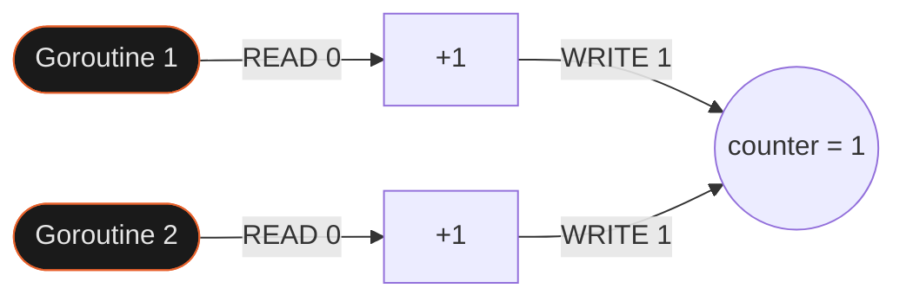
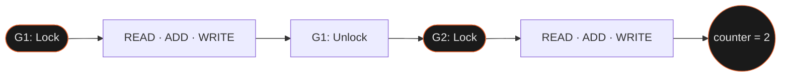

`counter++` выглядит как одна операция, но на уровне процессора это три шага: читать, прибавить, записать. Когда две горутины делают это одновременно — они могут прочитать одно и то же значение и оба записать одинаковый результат. Итог: вместо `2` получаешь `1`, и `go run -race` на это укажет.

## Зачем это нужно

JavaScript однопоточный — event loop гарантирует, что два обработчика не выполняются одновременно. Гонок данных нет по архитектурным причинам.

В Go горутины выполняются реально параллельно на разных CPU-ядрах. Любой доступ к shared state без синхронизации — потенциальная гонка данных. `sync.Mutex` гарантирует, что в критической секции находится только одна горутина одновременно.

## Как это устроено

**Без Mutex** — обе горутины читают одно значение и оба пишут одинаковый результат:



**С Mutex** — вторая горутина ждёт разблокировки первой:



`sync.Mutex` — zero value, не требует инициализации. `var mu sync.Mutex` или поле в структуре готово к использованию сразу.

```go
type SafeCounter struct {
    mu    sync.Mutex
    value int
}

func (c *SafeCounter) Inc() {
    c.mu.Lock()
    defer c.mu.Unlock()
    c.value++
}

func (c *SafeCounter) Get() int {
    c.mu.Lock()
    defer c.mu.Unlock()
    return c.value
}
```

## Как использовать

**`sync.RWMutex` — когда чтений много, записей мало:**

```go
type Cache struct {
    mu   sync.RWMutex
    data map[string]string
}

func (c *Cache) Get(key string) (string, bool) {
    c.mu.RLock()         // разделяемая: несколько читателей одновременно
    defer c.mu.RUnlock()
    return c.data[key]
}

func (c *Cache) Set(key, value string) {
    c.mu.Lock()          // эксклюзивная: только один писатель
    defer c.mu.Unlock()
    c.data[key] = value
}
```

`RLock` не блокирует других читателей — только запись. Используй когда соотношение R/W явно высокое, иначе накладные расходы на RLock/RUnlock не оправданы.

**`sync.Once` — ленивая инициализация ровно один раз:**

```go
type Config struct {
    once sync.Once
    data map[string]string
}

func (c *Config) Get(key string) string {
    c.once.Do(func() {
        c.data = loadFromDisk() // выполнится один раз, остальные горутины подождут
    })
    return c.data[key]
}
```

`sync.Once` безопаснее и нагляднее чем флаг `initialized bool` с отдельным Mutex.

**Детектор гонок:**

```bash
go run -race main.go
go test -race ./...
```

Ловит обращения без синхронизации и печатает стектрейс. Гонка может проявиться только под нагрузкой — детектор обнаруживает её при обычном запуске.

## Подводные камни

**`defer mu.Unlock()` — не просто удобство:**

```go
// ❌ паника между Lock и Unlock — Unlock не вызовется, все горутины заблокируются навсегда
c.mu.Lock()
c.value++
c.mu.Unlock()

// ✅ defer гарантирует разблокировку при любом завершении, включая панику
c.mu.Lock()
defer c.mu.Unlock()
c.value++
```

**Не копировать Mutex:**

```go
// ❌ копирование Mutex копирует его состояние — заблокированный останется заблокированным
counter2 := counter1

// ✅ передавай через указатель
func process(c *SafeCounter) { ... }
```

**Lock нужен и для чтения:**

```go
// ❌ читатель без Lock — race condition если другая горутина пишет одновременно
func (c *SafeCounter) Get() int {
    return c.value
}

// ✅
func (c *SafeCounter) Get() int {
    c.mu.Lock()
    defer c.mu.Unlock()
    return c.value
}
```

## Лучшие практики

- **`defer mu.Unlock()` сразу после `Lock`** — не позволяет забыть разблокировку и защищает от паники.
- **Инкапсулируй Mutex в структуру** — не делай поле `mu` публичным, не передавай Mutex по значению.
- **`RWMutex` только при явном преимуществе** — если чтений значительно больше записей. В остальных случаях обычный Mutex проще.
- **`sync.Once` для инициализации** — вместо флага `initialized bool` с Mutex: безопаснее и нагляднее.
- **`go test -race` в CI** — гонки воспроизводятся не всегда при ручном тесте, детектор ловит их стабильно.

## Итого

- **`counter++` не атомарный** — read + add + write. Без Mutex race condition при параллельных горутинах.
- **Zero value** — `var mu sync.Mutex` готова к использованию без инициализации. Но не копируй — копирование копирует состояние.
- **Lock нужен и для чтения** — одновременное чтение и запись без синхронизации = race condition.
- **`RWMutex` не всегда быстрее** — накладные расходы на RLock/RUnlock оправданы только при высоком соотношении R/W.
- Дальше: `sync/atomic` для простых счётчиков без Mutex, `sync.Map` для конкурентных мап.

## Документация

- [pkg.go.dev/sync](https://pkg.go.dev/sync) — пакет sync: Mutex, RWMutex, Once, WaitGroup
- [go.dev/ref/mem](https://go.dev/ref/mem) — Go Memory Model: happens-before и гарантии синхронизации
- [go.dev/doc/articles/race_detector](https://go.dev/doc/articles/race_detector) — Race Detector: как использовать `-race`
