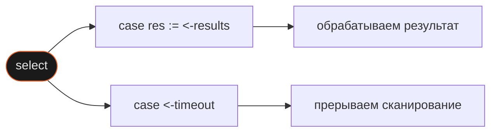

Когда несколько горутин пишут в разные каналы, нужно читать из всех одновременно — не поочерёдно. Без `select` пришлось бы выбирать: читать из канала A и блокироваться пока B молчит, или наоборот. `select` решает это: он ждёт все каналы сразу и реагирует на первый готовый.

## Зачем это нужно

В port scanner три хоста отвечают с разными задержками: один через 500 мс, второй через 1 с, третий — через 3 с. Если читать каналы последовательно, ждём каждый хост по очереди. `select` даёт результаты в порядке готовности.

Аналогия с JS: `select` похож на `Promise.race([p1, p2, p3])`, но не одноразовый — он работает в цикле и обрабатывает каждый результат по мере прихода. В JS нет прямого аналога `select` в цикле — обычно для этого комбинируют `Promise.all` и отдельные колбэки.

## Как это устроено

`select` проверяет все `case` одновременно. Если несколько каналов готовы одновременно — выбирает один случайно. Если ни один не готов — блокируется до первого готового.

```go
select {
case res := <-results:
    fmt.Printf("%s: open\n", res.host)
case <-timeout:
    fmt.Println("timeout")
    return
}
```

Каждый `case` — это операция с каналом: чтение (`<-ch`) или запись (`ch <- v`). Все `case` равноправны — `select` не проверяет их сверху вниз.



`default` делает `select` **non-blocking**: если ни один канал не готов, сразу выполняется `default`. Без `default` — блокируется.

```go
select {
case v := <-ch:
    process(v)
default:
    // канал пуст — не блокируемся, идём дальше
}
```

## Как использовать

**Паттерн таймаута для сканера** — один буферизованный канал результатов, `time.After` создаётся до цикла:

```go
out := make(chan result, len(hosts))
for i, h := range hosts {
    scanner(h, delays[i], out)
}

// time.After — ДО цикла, иначе таймаут сбрасывается на каждой итерации
timeout := time.After(2 * time.Second)

pending := map[string]bool{
    "192.168.1.1": true,
    "192.168.1.2": true,
    "192.168.1.3": true,
}

for i := 0; i < len(hosts); i++ {
    select {
    case res := <-out:
        fmt.Printf("%s: open\n", res.host)
        delete(pending, res.host)
    case <-timeout:
        for ip := range pending {
            fmt.Printf("%s: timeout\n", ip)
        }
        return
    }
}
```

`scanner` пишет в общий канал `out` через направленный тип `chan<-` — горутина может только писать:

```go
func scanner(host string, delay time.Duration, out chan<- result) {
    go func() {
        time.Sleep(delay)
        out <- result{host: host, open: true}
    }()
}
```

## Подводные камни

**`time.After` внутри цикла сбрасывает таймаут**

```go
❌ for i := 0; i < len(hosts); i++ {
       select {
       case res := <-out:
           process(res)
       case <-time.After(2 * time.Second): // новый таймер на каждой итерации!
           return
       }
   }
```

```go
✅ timeout := time.After(2 * time.Second) // один таймер на весь цикл
   for i := 0; i < len(hosts); i++ {
       select {
       case res := <-out:
           process(res)
       case <-timeout:
           return
       }
   }
```

Если таймер создавать в цикле — каждая итерация запускает отсчёт заново. Медленный хост всегда получает полные 2 секунды, независимо от того сколько уже прошло.

**Отдельный канал на каждый хост не масштабируется**

```go
❌ select {
   case res := <-ch1:
       fmt.Println(res)
   case res := <-ch2:
       fmt.Println(res)
   case res := <-ch3:
       fmt.Println(res)
   }
```

```go
✅ out := make(chan result, len(hosts))
   // все горутины пишут в один канал
   select {
   case res := <-out:
       fmt.Println(res.host)
   }
```

С отдельным каналом на каждый хост `select` разрастается вместе с их числом. Один общий канал со struct масштабируется на любое количество горутин без изменений в `select`.

**`delete(map, key)` — не то же что удаление из slice**

```go
❌ pending = remove(pending, host) // самодельная функция, переприсваивание
```

```go
✅ delete(pending, host) // встроенная функция, меняет map на месте
```

Map — ссылочный тип, `delete` изменяет её на месте. Slice — нет, нужно переприсваивать. Для tracking pending-хостов map удобнее.

## Лучшие практики

**`time.After` создавать до цикла** — один таймер на весь процесс, не на каждую итерацию.

**Один общий канал вместо отдельных на каждую горутину** — масштабируется без изменений в `select`.

**Направление канала в сигнатуре** — `chan<- result` (только запись) и `<-chan result` (только чтение) документируют намерение и ловят ошибки на этапе компиляции.

**`default` только когда нужен non-blocking** — без `default` `select` блокируется; с `default` — polling. Не добавлять по умолчанию.

## Итого

- **`select` ждёт все `case` одновременно** — не поочерёдно, выбирает первый готовый.
- **`time.After` создаётся до цикла** — иначе каждая итерация перезапускает таймер.
- **Один общий канал + struct** масштабируется на любое число горутин без изменений в `select`.
- **`delete(map, key)` изменяет map на месте** — в отличие от slice, переприсваивание не нужно.
- Следующий шаг: `context.Context` — более гибкая отмена с передачей дедлайнов через цепочку вызовов.

## Документация

- [go.dev/ref/spec#Select_statements](https://go.dev/ref/spec#Select_statements) — спецификация select
- [go.dev/doc/effective_go#select](https://go.dev/doc/effective_go#select) — Effective Go: select
- [pkg.go.dev/time#After](https://pkg.go.dev/time#After) — time.After
- [pkg.go.dev/builtin#delete](https://pkg.go.dev/builtin#delete) — встроенная delete
